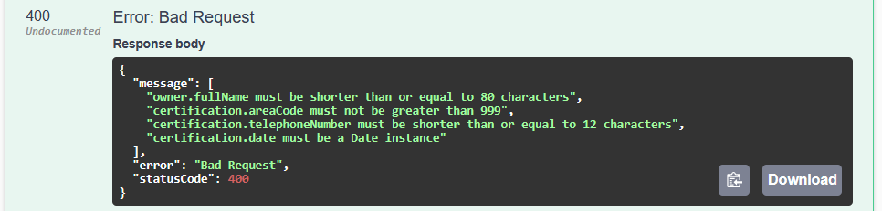
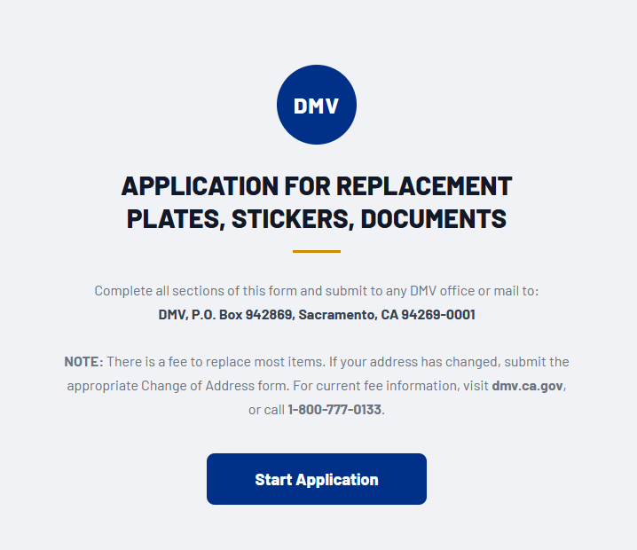
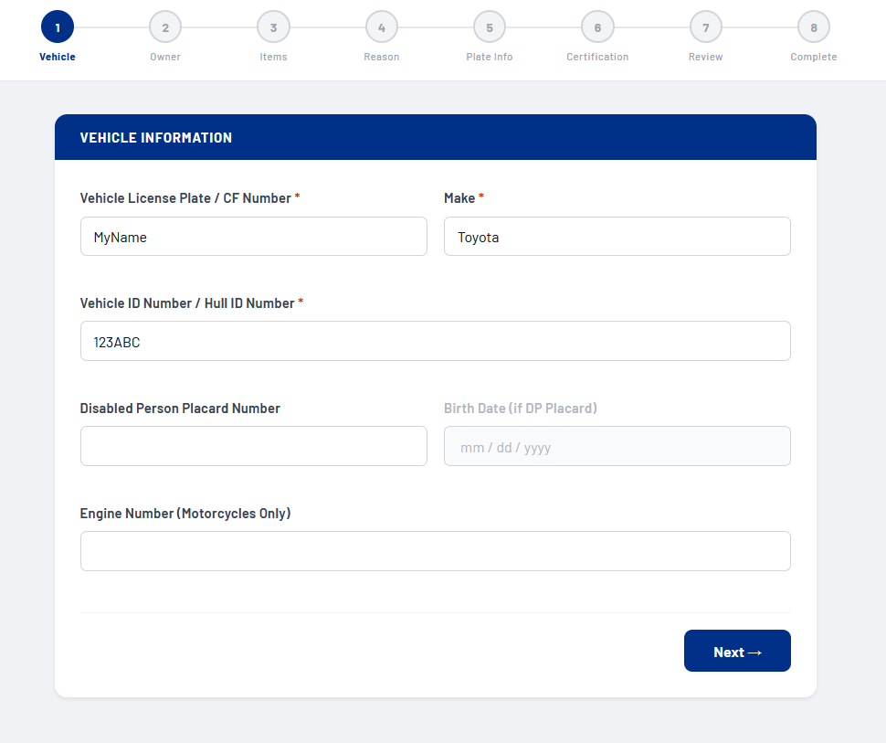

## REG 156 (REV. 11/2024) WWW DMV Form App

## Stack

- Frontend: `React`
- Backend: `Nest.js`


## Setup & Run

1. Clone the repository locally using the command:
```bash
git clone git@github.com:igurman/dmv-registration-form.git
```

2. Run the command to get node_modules:
```bash
npm install:all
```

3. Launch the project:
```bash
npm start
```
4. Now you have two services:
- Frontend: http://localhost:3000
- Backend API: http://localhost:5000

## API

Swagger is available for the backend at: http://localhost:5000/swagger

You can try calling the method http://localhost:5000/api/v1/form with data from the file: <a href="backend/test/http/http-requests.http">requests.http</a>

Request validation example:



Example of a website:





Don't worry about mistakes, the service will tell you the right way.<br>
At any time, you can go back to the previous steps and edit the data.<br>

Go through all the steps and get a PDF-file for the DMV.
